Viewing your VM through `virt-manager` GUI, doesn't allow you to make a display that utilizes your **dGPU**. It uses a ***virtual display*** thats not using your **dGPU**

One way to solve this, is to connect a physical monitor directly to your **dGPU** when your VM is running. But that requires **another monitor** and **full pass through of a USB Keyboard/Mouse** (which wont allow you to use them on your Linux host simultaneously)

That's not fun. But there is this cool Application called **Looking Glass** 

**Looking Glass** allows you to share a data buffer between your **Linux Host** and **Windows VM** that passes data back and forth like
- Render dGPU frames
- Keyboard/Mouse Input

It does require
- Looking Glass **Client** on your **Linux Host**
- Looking Glass **Host** on your **Windows PC**
- Configuring QEMU to 

### 1) Install Looking Glass Client on Arch Linux
```bash
# Install from AUR 
yay -S looking-glass
```

### 2) Check if `libvirtd` is Running & Your VM is Listed

Run
```bash
sudo systemctl status libvirtd
# .... ACTIVE
```

Run to check if your VM is listed
```bash
# Check if the VM is defined in libvirt
sudo virsh list --all
# OUTPUT LIKE
	# Id   Name    State  
	#------------------------  
	# -    win11   shut off
```

---
### 3) Configure Your VM to Use ***IVSHMEM***

Run
```bash
sudo virt-xml <VM_NAME> --add-device --shmem name=looking-glass,model.type=ivshmem-plain,size=128,size.unit=M
```

This commands adds the following code inside the `<devices>` section of your `/etc/libvirt/qemu/<VM_NAME>.xml`
```xml
<devices>
  <!-- Your existing devices -->
  <shmem name='looking-glass'>
    <model type='ivshmem-plain'/>
    <size unit='M'>128</size>
  </shmem>
</devices>
```

> [!WARNING] For higher resolutions/refresh rates, increase IVSHMEM size:
> - 1080p@60Hz: 32MB (default)
> - 1440p@60Hz: 64MB
> - 4K@60Hz: 128MB

> [!INFO] What is ***IVSHMEM***?
> **Inter-VM Shared Memory**. Its a feature in **QEMU** that allows **Virtual Machines** to share a chunk of memory with the **Host System** (or other VMs)

```mermaid
flowchart LR
    subgraph VM["🪟 Windows VM"]
        DGPU["🎮 dGPU<br/>(Passed Through)"] 
        --> LGH["Looking Glass Host<br/>(Windows Service)"]
    end
    
    subgraph QEMU["⚙️ QEMU/KVM"]
        IVSHMEM["📡 IVSHMEM<br/>(Memory Bridge)"]
    end
    
    subgraph Host["🐧 Linux Host"]
        SHM["📁 /dev/shm/looking-glass<br/>(32MB+ Shared RAM)"]
        --> LGC["Looking Glass Client"]
        --> Display["🖥️ Your Monitor"]
    end
    
    %% Main data flow
    LGH --> IVSHMEM --> SHM
    
    %% QEMU setup (cleaner connections)
    IVSHMEM -.->|"maps to"| SHM
```



### 4) Create Shared Memory File and Recreate on Every Host Reboot

Create shared memory file
```bash
# Create the shared memory file
sudo touch /dev/shm/looking-glass # This file will get deleted on host reboot
sudo chown $USER:users /dev/shm/looking-glass
sudo chmod 660 /dev/shm/looking-glass
```

> [!INFO] What is `/dev/shm/`?
> - `/dev/shm/` is a special folder that exists in RAM (not on your disk)
> - It's called "shared memory" because multiple programs can access the same file
> - Looking Glass uses this to share video frames between Windows (guest) and Linux (host)

Create `systemd` service file
```bash
nano /etc/systemd/system/looking-glass-shm.service
```
 
 with the following contents
```ini
[Unit]
Description=Create Looking Glass shared memory
After=dev-shm.mount

[Service]
Type=oneshot
ExecStart=/bin/bash -c 'touch /dev/shm/looking-glass && chown $USER:users /dev/shm/looking-glass && chmod 660 /dev/shm/looking-glass'
RemainAfterExit=yes

[Install]
WantedBy=multi-user.target
```

Check the file exists
```bash
ls -la /etc/systemd/system/looking-glass-shm.service
```

Enable newly created service to run on every boot
```bash
# Enable the service to run automatically on every boot
sudo systemctl enable looking-glass-shm.service
```

Check if Service is Enabled/Running & Creating the Shared Memory File
```bash
# Check if the service is enabled
sudo systemctl is-enabled looking-glass-shm.service
# Should show: enabled

# Check if the service is running
sudo systemctl status looking-glass-shm.service
# Should show: active (exited)

# Check if the file was created
ls -la /dev/shm/looking-glass
# Should show the file with correct permissions
```


---

### 5) Start Your VM through Virt-Manager
1) Just click ***"Start"*** in `virt-manager` like normal
	- ✅ `virt-manager` will generate all the QEMU parameters automatically
	- ❌ Will not auto create `shared memory file`
		- Since it lives in `tmpfs` (temp filesystem) that lives in `RAM`


---

### 6) Launch ***Looking Glass*** separately 
```bash
looking-glass-client
```

> [!INFO] What ***Virt-Manager*** does behind the scenes
> When you click "Start" in virt-manager, it actually:
> 1. **Creates the shared memory file** automatically
> 	- My current version of `virt-manager` doesn't support this, hence the previous steps 
> 2. **Generates the full QEMU command** (including those `IVSHMEM` parameters)
> 3. **Starts QEMU** with all the right options
> 4. **Manages the VM lifecycle**

### 5) Windows - Download and Install ***Looking Glass Host***
1) Download the Windows host from: [https://looking-glass.io/downloads](https://looking-glass.io/downloads)
2) Extract and run `looking-glass-host-setup.exe` as Administrator
3) The installer will:
    - Install the `Looking Glass service`
    - Install the `IVSHMEM` driver
    - Configure automatic startup

### 6) Windows - Install ***IVSHMEM*** Drivers 
1) In Windows Device Manager, look for "PCI Memory Controller" with yellow warning
2) Right-click → Update Driver → Browse → Point to extracted Looking Glass folder
3) Navigate to `host/platform/Windows/ivshmem/`

> [!WARNING] Verify ***IVSHMEM*** Installation 
> 1) Open Services (`services.msc`)
> 2) Look for *"Looking Glass (host)"* service
> 3) Ensure it's set to *"Automatic"* and "Started"
